# Connection Manager (`--cm`) — архитектурные диаграммы

> Документ описывает **Connection Manager (CM)** — UI на стороне **контролируемого хоста** (машина, к которой подключаются).
> Источник: [rustdesk/rustdesk](https://github.com/rustdesk/rustdesk) — `flutter/lib/desktop/pages/server_page.dart`, `flutter/lib/models/server_model.dart`, `flutter/lib/main.dart`.

---

## 1. Роль CM в системе

Connection Manager — **отдельный процесс/окно**, запускаемый флагом `--cm`. Он появляется, когда удалённый клиент пытается подключиться к этой машине, и позволяет пользователю:

- увидеть входящее подключение;
- **авторизовать** или **отклонить** сессию;
- управлять **разрешениями** (клавиатура, буфер обмена, файлы, аудио, запись);
- обмениваться **чатом** и **голосовыми вызовами**;
- закрыть или отключить клиента.

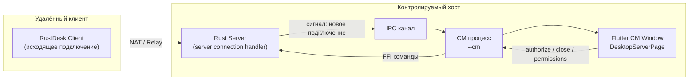

---

## 2. Точки входа и жизненный цикл процесса

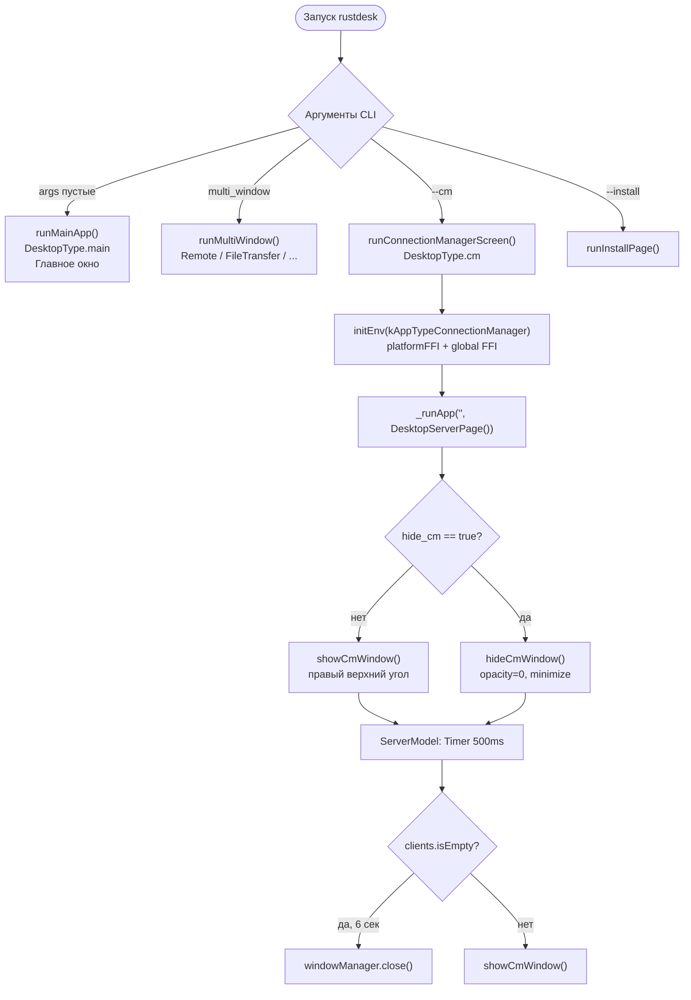

| Параметр | Значение |
|---|---|
| CLI-флаг | `--cm` |
| `DesktopType` | `DesktopType.cm` |
| App type | `kAppTypeConnectionManager` |
| Root widget | `DesktopServerPage` |
| Окно | Отдельное (не `desktop_multi_window`, а **отдельный процесс**) |
| Размер окна | `kConnectionManagerWindowSizeClosedChat` |
| Позиция | `Alignment.topRight` |

---

## 3. Иерархия виджетов (Presentation)

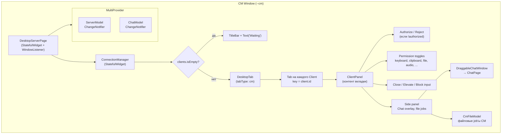

### Поведение при закрытии окна

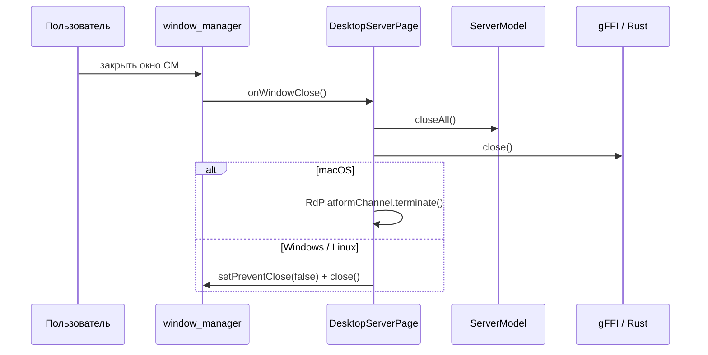

---

## 4. Модель данных

### 4.1 ServerModel — центральное состояние CM

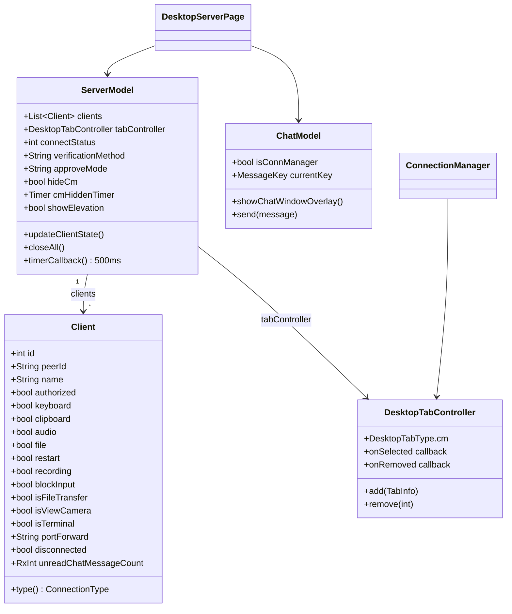

### 4.2 Client — типы входящих подключений

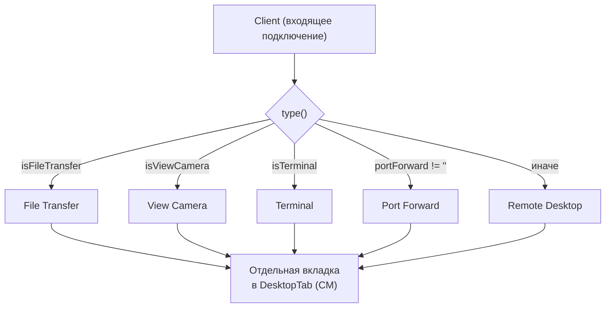

---

## 5. Поток входящего подключения

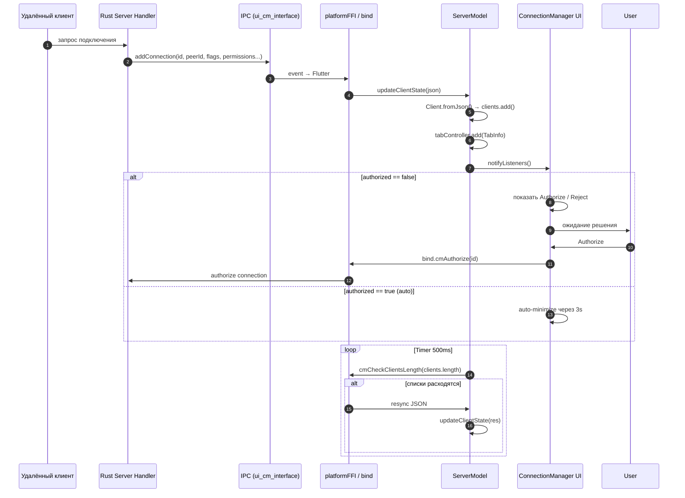

---

## 6. Действия пользователя в CM

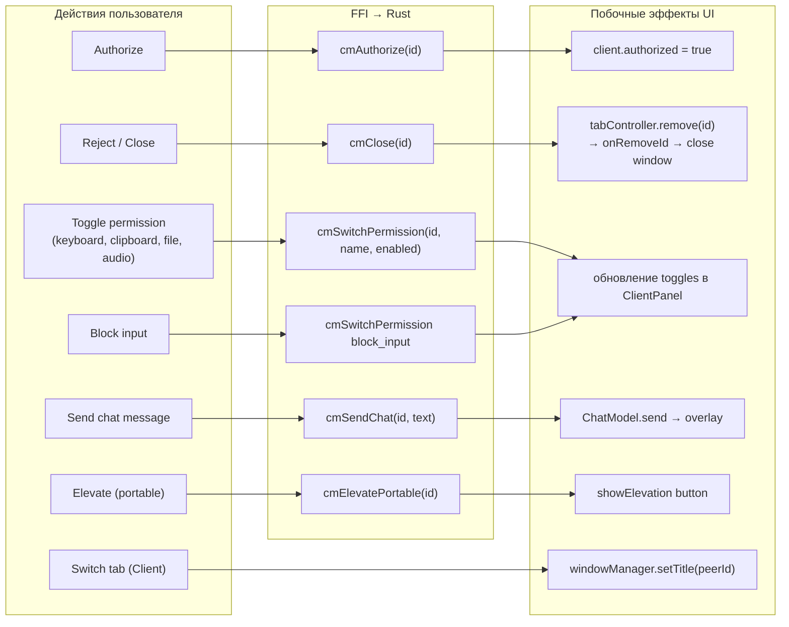

### Переключение вкладки (onSelected)

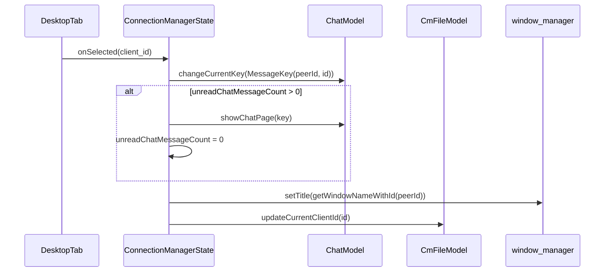

---

## 7. Timer loop ServerModel (500 ms)

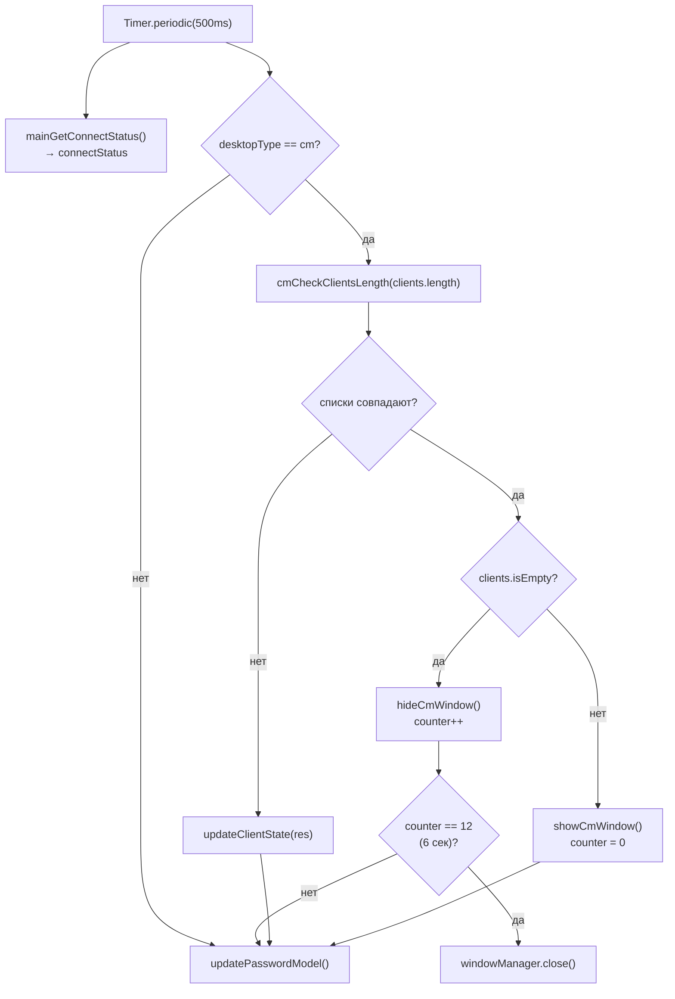

---

## 8. Интеграция чата и голосовых вызовов

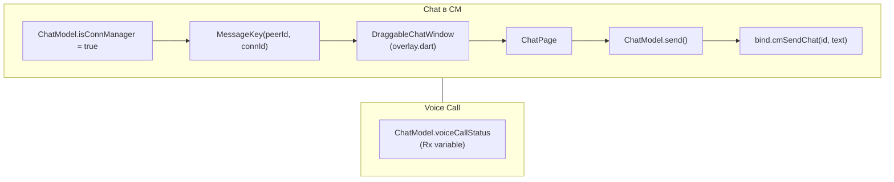

---

## 9. Процессная архитектура (Rust ↔ Flutter)

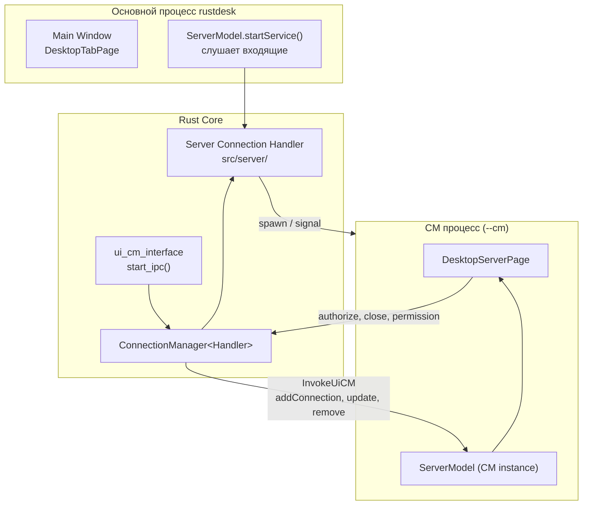

---

## 10. Предлагаемая Clean Architecture для CM

> Целевой стек: **Riverpod 3** + **Freezed** + **desktop_multi_window** (опционально CM может остаться отдельным процессом, как в RustDesk).

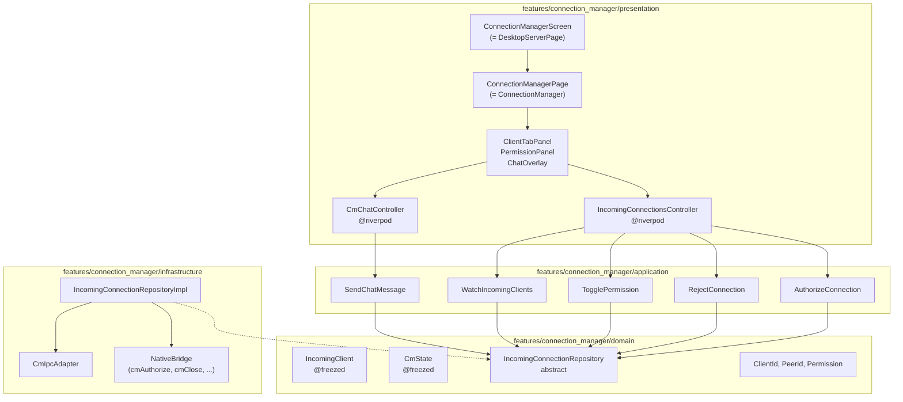

### Маппинг RustDesk → Clean Architecture (CM)

| RustDesk | Clean Architecture |
|---|---|
| `DesktopServerPage` | `ConnectionManagerScreen` |
| `ConnectionManager` | `ConnectionManagerPage` |
| `ServerModel` | `IncomingConnectionsController` + `CmState` |
| `Client` | `IncomingClient` (@freezed) |
| `ChatModel` (CM mode) | `CmChatController` |
| `CmFileModel` | `CmFileTransferController` |
| `bind.cmAuthorize` etc. | `IncomingConnectionRepository` |
| `gFFI.serverModel` | `@Riverpod(keepAlive: true)` providers |
| Timer 500ms в ServerModel | `ref.listen` + `Stream` из repository |

### Bootstrap CM (Riverpod 3)

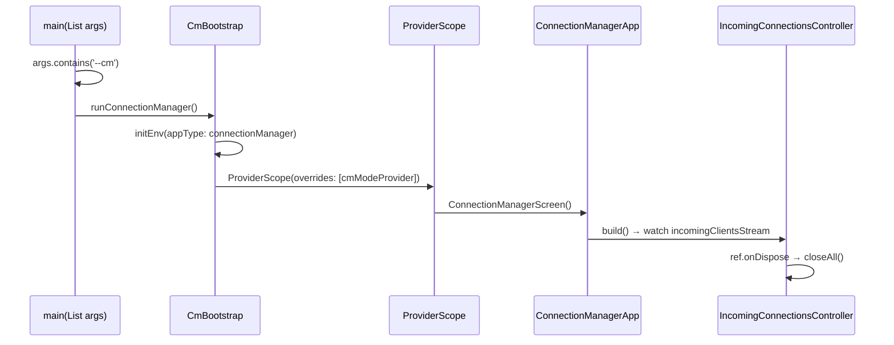

---

## 11. Сводная таблица FFI-вызовов CM

| FFI (`bind.*`) | Назначение |
|---|---|
| `cmCheckClientsLength(length)` | Сверка списка клиентов Flutter ↔ Rust |
| `cmAuthorize(id)` | Разрешить подключение |
| `cmClose(id)` | Закрыть / отклонить |
| `cmSwitchPermission(id, name, enabled)` | Переключить разрешение |
| `cmSendChat(id, text)` | Отправить сообщение чата |
| `cmElevatePortable(id)` | Повысить привилегии (portable) |
| `mainGetConnectStatus()` | Статус rendezvous-сервера |
| `mainGetTemporaryPassword()` | Временный пароль хоста |
| `mainSetOption(key, value)` | Настройки approve/verification |
| `cmGetConfig(name: "hide_cm")` | Скрытый режим CM при старте |

---

## Связанные файлы RustDesk

| Файл | Назначение |
|---|---|
| `flutter/lib/main.dart` | `runConnectionManagerScreen()`, `showCmWindow()`, `hideCmWindow()` |
| `flutter/lib/desktop/pages/server_page.dart` | `DesktopServerPage`, `ConnectionManager`, UI панели |
| `flutter/lib/models/server_model.dart` | `ServerModel`, `Client`, timer loop |
| `flutter/lib/models/chat_model.dart` | Чат в режиме CM |
| `flutter/lib/models/cm_file_model.dart` | Файловые операции в CM |
| `src/ui/cm.rs` | Legacy Sciter CM (Rust) |
| `src/ui_cm_interface.rs` | IPC между server и CM UI |
